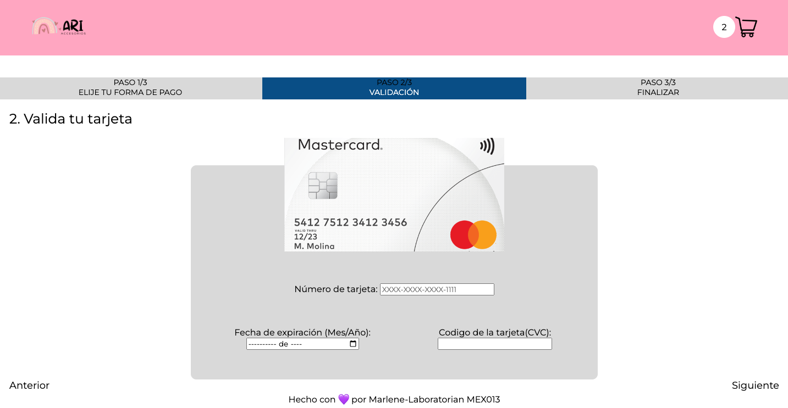
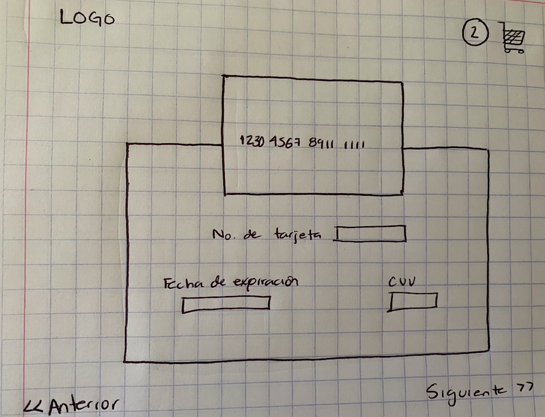
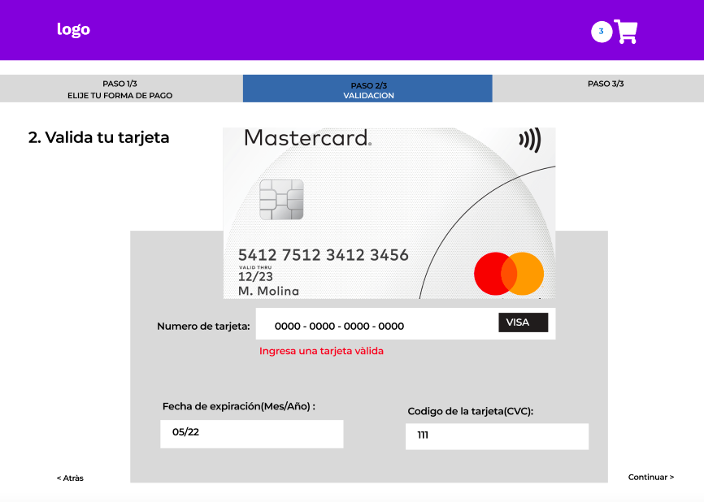

# Tarjeta de crédito válida

## Índice

* [1. Resumen del proyecto](#1-resumen-del-proyecto)
* [2. Vista del proyecto](#2-Vista-del-proyecto)
* [3. Investigación UX](#3-Investigación-UX)

***

## 1. Resumen del proyecto

Esta aplicación web le permite al usuario conocer si su tarjeta es válida o no, además una vez que ingresa los 16 números de su tarjeta los primeros dígitos son enmascarados y los últimos 4 son los únicos que se muestras en pantalla.

## 2. Vista del proyecto

## 3. Investigación UX

3.1 Quiénes son los usuarios y objetivos en relacion con el producto
Los usuarios de esta aplicación web están realizando la validación de su tarjeta para despues finalizar su compra en una tienda en línea. El usuario puede ver un mensaje en color verde "La tarjeta es válida" o un mensaje en color rojo "La tarjeta es inválida".

3.2 Cómo el producto soluciona problemas/necesidades de los usuario
La aplicación web card-validation le permite al usuario ver rápidamente si su tarjeta es válida o no despues de haber colocado los 16 dígitos de su tarjeta, además que para cuidar su seguridad, solo los últimos 4 dígitos son visibles.

3.3 Proceso para llegar a la versión final

-Prototipo inicial:

Quería que el usuario tuviera una imagen de referencia donde se mostraran los 16 digitos de una tarjeta de crédito.

-En mi prototipo me sugieron indicar en dónde se mostraría el mensaje que aparecería al usuario al validar su tarjeta, otra sugerencia fue usar algun color claro en el header y centrar la imagen del contenedor principal.

-Prototipo final:

Resultado final del prototipo realizado en figma.